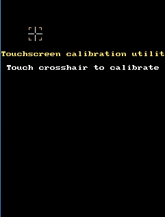

Für die Arbeit mit der CFW gibt es bereits zahlreiche Apps, die je nach Zweck in verschiedene Ordner einsortiert sind.

# Ordner "System"

In diesem Ordner finden sich nützliche Apps, die bereits in die CFW integriert sind.

## Über

In dieser kleinen App finden sich Daten zu der aktuellen Version der CFW und der verwendeten Bibliotheken sowie die Texte der verwendeten Lizenzen.

## Bluetooth

Mit der CFW Bluetooth app kannst du den TXT mit dem Transmitter des BT Conrol Sets oder mit der Bluetooth Control App aud einem Smartphone verbinden. 

## Display

Mit dieser App kannst Du die Bildschirmdarstellung drehen und den Touchscreen kalibrieren, so dass die Druckereignisse genauer mit der richtigen Position verarbeitet werden.
Nach dem Start der App kannst du auswählen, ob der Bildschirm um 0 ° (Standardausrichtung), 90 ° (Querformat, gegen den Uhrzeigersinn gedreht), 180 ° (auf den Kopf gestellt) oder 270 ° (Querformat, im Uhrzeigersinn gedreht) ausgerichtet werden soll. Nach Druck auf "Touchscreen kalibrieren" erscheinen nacheinander an verschiedenen Stellen Fadenkreuze, die du sorgfältig und möglichst genau (ggf. mit einem Stift) drückst.

Danach wird die neue Kalibrierung übernommen.

Wenn hier etwas schief läuft, kann es passieren, dass du den Touchscreen nicht mehr verwenden kannst. Dann musst du dich über SSH direkt auf dem TXT einloggen und die ursprüngliche Konfiguration wieder zurückschreiben. Ein Passwort brauchst du dafür nicht, nur ein SSH-Client (unter Windows z.B. Putty) und die IP-Adresse deines TXT.

    ssh ftc@192.168.0.12
    sudo cp /media/sdcard/root/etc/pointercal /etc/pointercal
    
Damit wird die Standardkalibrierung wieder eingerichtet und du kannst nach einem Neustart den Touchscreen wieder benutzen. Den Zugriff über SSH musst du allerdings auf dem Touchscreen des TXT erlauben. Wenn die Kalibrierung also soweit abweicht, dass du den OK-Button dafür nicht mehr treffen kannst, musst du im Notfall die CFW neu installieren.   

## FT-GUI

FT-GUI greift auf die Original-TXT-GUI zu. Dies ist notwendig, um RoboPro-Programme in der CFW-Umgebung ausführen zu können. Vor dem Start von RoboPro muss daher diese App gestartet werden. Ein _kurzer_ Druck auf den ON/OFF-Knopf beendet diese App und bringt dich wieder auf die CFW-GUI.

## Sprache

Hier kannst du eine Sprache für die CFW-GUI auswählen. Bitte hilf mit, die fehlenden Übersetzungen zu liefern.

## Netzwerk

Mit dieser App lassen sich Netwerk-Einstellungen wie IP-Adresse, Netzmaske und Gateway konfigurieren. Im Normalfall ist die Standardeinstellung "Automatisch" der einfachste Weg, deinen TXT mit dem Internet zu verbinden.

## Store

Der Store erlaubt die Installation von vielen interessanten Apps für die CFW, zum Beispiel zu Werkzeugen für die Programmierung. Für den Zugriff auf den Server, um die Apps auflisten und installieren zu können, muss der TXT mit dem Internet verbunden sein. 

## WLAN

Mit dieser App werden die WLAN-Parameter eingestellt.

# Apps im Store

Du kannst hier eine App aus der Liste auswählen und erhälst eine kurze Beschreibung, die auch Autor, Kategorie, die nötige Firmware-Version und und die aktuelle Versionsnummer der App enthält. Mit dem Menü-Icon oben links erhälst du einen Button "Installieren", mit dem du die ausgewählte App installieren kannst. Für jede Kategorie wird ein eigener Ordner angelegt.

## 3Dprint

App für den Fischertechnik-3D-Drucker

## BenoiTXT

Diese App zeigt, dass auch der TXT Mandelbrot-Bilder generieren kann.

## BricklyMCP

Das Brickly Master Control Program zum Verwalten (Speichern, Verschieben, Löschen) von Brickly-Programmen.

## Brickly

Eine grafische Programmierumgebung, besonders für Anfänger. Diese Anwendung wird ausführlich [hier](../programming/brickly) dokumentiert.

## CPU-Load

Diese kleine App zeigt Prozessorlast und RAM-Verbrauch an.

## I2C

Eine App zum Scannen des I2C-Busses.

## IOlyser

Mit diesem Werkzeug lassen sich direkt auf dem TXT alle Ein- und Ausgänge überprüfen.

## Radio

Leider funktioniert diese App momentan nicht.

## TXTShow

Eine App zum Fotografieren mit der TXT-Kamera und zur Verwaltung der Fotos.

## ft:db

Zur Suche in der [ft:db](https://ft-datenbank.de/). Setzt Internet-Zugriff voraus.

## ftDuinoIO

App zum Testen und Flashen des [ftDuinos](http://ftduino.de)

## startIDE

Entwicklungsumgebung, um direkt auf dem TXT programmieren zu können. Die Anleitung findet sich [hier](../programming/startide). 

